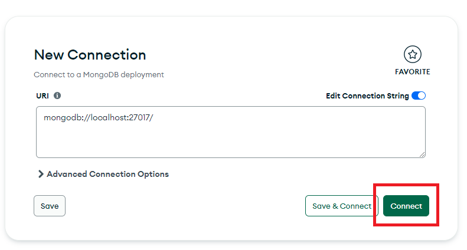

# One Card

One Card es un juego de cartas, desarrollado en NodeJS y ReactJS, con una base de datos MongoDB, de dos jugadores en línea inspirado en el universo de One Piece, donde dos jugadores compiten utilizando cartas de personajes, campos y cartas mágicas. 
Cada jugador elige una tripulación, ya sea Sombrero de Paja o Marina, y luchará con su mazo, el cual incluye personajes icónicos, cartas de campo que incrementan su energía y cartas mágicas con diversas habilidades. 
El objetivo es reducir los puntos de vida del oponente a cero mediante estrategias de ataque y defensa, utilizando las características y habilidades de cada carta. 

## Despliegue del proyecto con Docker

Se ha facilitado una configuración de contenedores de Docker de manera que se pueda desplegar la aplicación haciendo uso de un único comando.
Esta versión desplegada no incluye la configuración de BBDD, por lo que no podrá ser posible acceder a los endpoints proporcionados para el mantenimiento de las cartas. Además, las cartas cargadas serán las que se han predefinido en el archivo ./backBBDD/model/init_cartas.js

  :warning: **NOTA: Importante tener descargado e instalado Docker**

Para arrancar la creación y despliegue de los contenedores Docker deberemos lanzar el siguiente comando desde la raiz del proyecto:
  > docker-compose up --build

## Configuración del proyecto

La configuración indicada a continuación únicamente será necesario realizarla una vez.

### Configuración de la BBDD
- Descargar e instalar [MongoDB](https://fastdl.mongodb.org/windows/mongodb-windows-x86_64-7.0.11-signed.msi)
- Abrir MongoDB
- Conectar con la configuración por defecto
  
- En el menú lateral izquierdo, seleccionar el icono + (más) que se encuentra a la derecha de `Databases`
  
- Rellenar la información de la base de datos con los siguientes datos y hacer click en `Create Database`:
  > Database Name: oneCard
  
  > Collection Name: cartas

  :warning: **NOTA: Importante respetar mayúsculas y minúsculas**

  

- Dentro de la base de datos que acabamos de crear, hacemos click en el desplegable `ADD DATA` y seleccionamos la opción `Import JSON or CSV file`
  

- Se nos abrirá un cuadro para cargar un fichero JSON o CSV. Deberemos dirigirnos al directorio `./doc/BBDD` donde seleccionaremos el fichero `script cargar carts.json`, el cual contiene toda la información referente a las cartas para poder ejecutar el juego correctamente.
  

- Por último, importamos los datos que acabamos de seleccionar:
  

### Configuración del servidor
- Descargar e instalar [NodeJS](https://nodejs.org/dist/v20.13.1/node-v20.13.1-x64.msi)

Para un correcto funcionamiento de la aplicación deberán descargarse las dependencias necesarias.
Para ello, desde la terminal, deberemos acceder al directorio `./backBBDD/` y ejecutar el siguiente comando:
  > `npm install`

### Configuración del cliente
:warning: Importante tener instalado NodeJS (enlace en la configuración del servidor)

Para un correcto funcionamiento de la aplicación deberán descargarse las dependencias necesarias.
Para ello, desde la terminal, deberemos acceder al directorio `./front/` y ejecutar el siguiente comando:
  > `npm install`

## Arranque del proyecto
### Arranque de la BBDD
En lo referente a la base de datos, únicamente deberemos asegurarnos de tenerla conectada con la configuración por defecto:
- Abrir MongoDB
- Conectar con la configuración por defecto
  

  
### Arranque del servidor
Para arrancar el servidor de nuestra aplicación deberemos de, desde la terminal, acceder al directorio `./backBBDD/` y ejecutar el siguiente comando:
  > `npm run start`

### Arranque del cliente
Para arrancar el cliente de nuestra aplicación deberemos de, desde una terminal diferente a la anterior, acceder al directorio `./front/` y ejecutar el siguiente comando:
  > `npm run start`

## Funcionamiento de la aplicación
Esta aplicación está preparada para que dos jugadores puedan jugar simultaneamente en el mismo equipo, por lo que necesitaremos abrir dos instancias de la aplicación en ventanas/pestañas diferentes.
Abriremos dos ventanas/pestañas en nuestro navegador favorito y abriremos la siguiente url:
> `http://localhost:5173/`

Si el juego se encuentra configurado y arrancado correctamente, deberemos visualizar la pantalla de inicio en cada una de las instancias abiertas:
  

:warning: NOTA: A partir de ahora nos referiremos a cada pantalla/pestaña abierta como un jugador.

En esta pantalla, cada jugador podrá acceder a una pantalla de información general del juego, con el icono de info que encuentra arriba a la izquierda:
  

Para iniciar la partida deberán, ambos jugadores, de seleccionar la tripulación con la que desean jugar (pudiendo tener ambos la misma).
  

Una vez seleccionada la tripulación, en caso de haberla seleccionado solamente uno de los jugadores, permacerá en la pantalla de juego sin que el tablero haya cargado, esperando a que el segundo jugador elija su tripulación:
  

Con los dos jugadores habiendo elegido tripulación, la partida puede comenzar y se cargará en ambas pantallas la información de las cartas que cada jugador tiene en la mano así como el botón de `Robar carta` en el caso del jugador que tenga el primer turno y demás información necesaria para llevar a cabo el juego:
  
